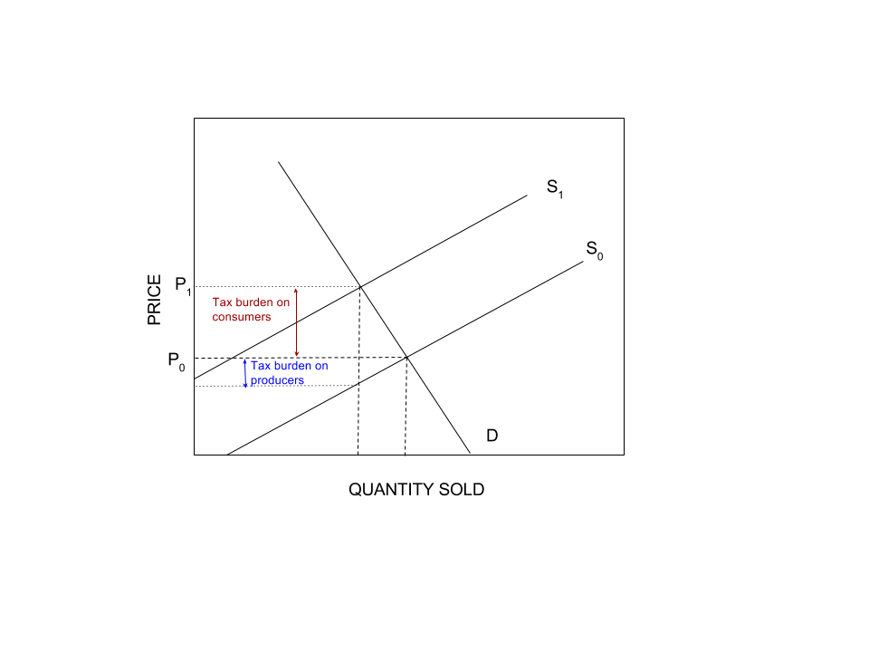
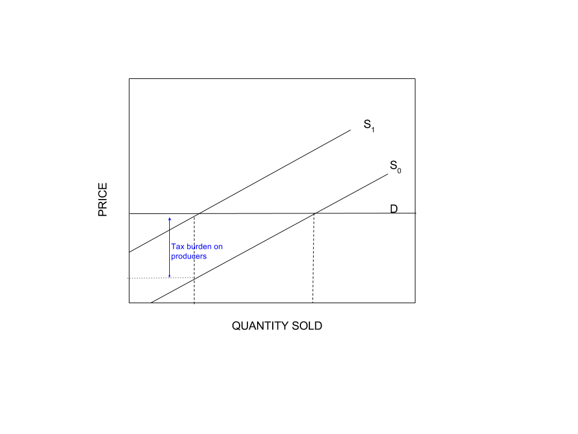
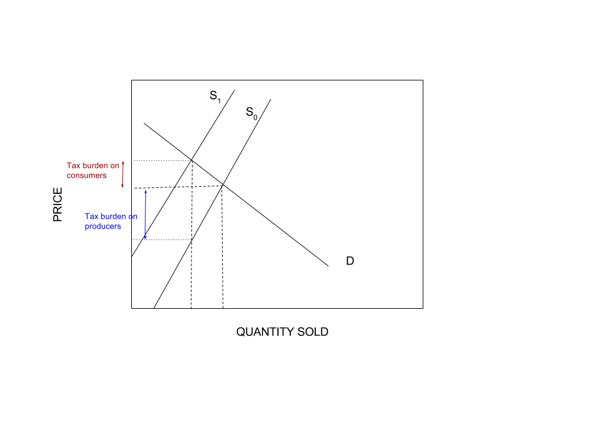
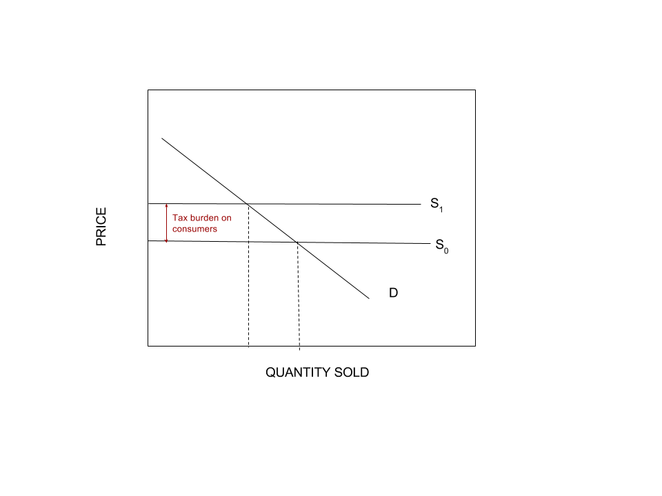

```{r}
library(ggplot2)
```


#### Question 1

*Discuss how you might go about validating the nuclear arms race model. What data would you collect? Is it possible to obtain the data?*

Engineering reliability studies on missles and their probability of success can be used to parameterize a simulation model. Studies of historical arms races - whether using nuclear weapons or otherwise, may be used. 

#### Question 2

*Build a numerical solution to Equations (15.8).*  
*a. Graph your results.*  
*b. Is an equilibrium value reached?*  
*c. Try other starting values. Do you think the equilibrium value is stable?*  
*d. Explore other values for the survival coefficients of Countries X and Y . Describe your results.*  

```{r}
y.func <- function(x){return(120 + 0.5 * x)}
x.func <- function(y){return(60 + (1/3) * y)}
```

```{r}
iterations = 10

x = 100
y = 200
```

```{r}

for  (i in 1:iterations){
  y.new <- y.func(x[i])
  y <- c(y, y.new)
  
  x.new <- x.func(y[1])
  x <- c(x, x.new)
}
```

```{r}
total.iterations <- 1:(iterations + 1)
results.set.2 <- as.data.frame(cbind(total.iterations, x, y))
```

```{r}
ggplot(data = results.set.2) + 
  geom_point(aes(x = total.iterations, y = x, color = "X")) + 
  geom_point(aes(x = total.iterations, y = y, color = "Y")) + 
  scale_color_manual(values = c("X" = "blue","Y" = "red"))
```

An equilibrium value is reached. 

```{r}
iterations = 10

x = 1
y = 2000
```

```{r}

for  (i in 1:iterations){
  y.new <- y.func(x[i])
  y <- c(y, y.new)
  
  x.new <- x.func(y[1])
  x <- c(x, x.new)
}
```

```{r}
total.iterations <- 1:(iterations + 1)
results.set.2 <- as.data.frame(cbind(total.iterations, x, y))
```

```{r}
ggplot(data = results.set.2) + 
  geom_point(aes(x = total.iterations, y = x, color = "X")) + 
  geom_point(aes(x = total.iterations, y = y, color = "Y")) + 
  scale_color_manual(values = c("X" = "blue","Y" = "red"))
```


```{r}
iterations = 10

x = 100
y = 2
```

```{r}

for  (i in 1:iterations){
  y.new <- y.func(x[i])
  y <- c(y, y.new)
  
  x.new <- x.func(y[1])
  x <- c(x, x.new)
}
```

```{r}
total.iterations <- 1:(iterations + 1)
results.set.2 <- as.data.frame(cbind(total.iterations, x, y))
```

```{r}
ggplot(data = results.set.2) + 
  geom_point(aes(x = total.iterations, y = x, color = "X")) + 
  geom_point(aes(x = total.iterations, y = y, color = "Y")) + 
  scale_color_manual(values = c("X" = "blue","Y" = "red"))
```

The equilibrium is stable. 

```{r}
y.func <- function(x){return(120 + 0.05 * x)}
x.func <- function(y){return(60 + (2) * y)}
```

```{r}
iterations = 10

x = 100
y = 200
```

```{r}

for  (i in 1:iterations){
  y.new <- y.func(x[i])
  y <- c(y, y.new)
  
  x.new <- x.func(y[1])
  x <- c(x, x.new)
}
```

```{r}
total.iterations <- 1:(iterations + 1)
results.set.2 <- as.data.frame(cbind(total.iterations, x, y))
```

```{r}
ggplot(data = results.set.2) + 
  geom_point(aes(x = total.iterations, y = x, color = "X")) + 
  geom_point(aes(x = total.iterations, y = y, color = "Y")) + 
  scale_color_manual(values = c("X" = "blue","Y" = "red"))
```


```{r}
y.func <- function(x){return(120 + 2.5 * x)}
x.func <- function(y){return(60 + (1/33333) * y)}
```

```{r}
iterations = 10

x = 100
y = 200
```

```{r}

for  (i in 1:iterations){
  y.new <- y.func(x[i])
  y <- c(y, y.new)
  
  x.new <- x.func(y[1])
  x <- c(x, x.new)
}
```

```{r}
total.iterations <- 1:(iterations + 1)
results.set.2 <- as.data.frame(cbind(total.iterations, x, y))
```

```{r}
ggplot(data = results.set.2) + 
  geom_point(aes(x = total.iterations, y = x, color = "X")) + 
  geom_point(aes(x = total.iterations, y = y, color = "Y")) + 
  scale_color_manual(values = c("X" = "blue","Y" = "red"))
```

#### Question 3

*Verify the result that the marginal revenue of the q+1st unit equals the price of that unit minus the loss in revenue on previous units resulting from price reduction.*


#### Question 4

*Show that when the demand curve is very steep, a tax added to each item sold will fall primarily on consumers. Now show that when the demand curve is more nearly horizontal, the tax is paid mostly by the industry. What if the supply curve is very steep? What if the supply curve is nearly horizontal?*

Show that when the demand curve is very steep, a tax added to each item sold will fall primarily on consumers.


When the demand curve is more nearly horizontal, the tax is paid mostly by the industry.


What if the supply curve is very steep?

The tax is mostly paid by industry.  

What if the supply curve is nearly horizontal?

The tax is mostly paid by consumers

#### Question 5

*Consider the graphical model in Figure 15.27. Argue that if the demand curve fails to shift significantly to the left, an increase in the equilibrium quantity could occur after the crisis.*

After the crisis, supply increases and the price drops. Pent up demand, caused by people delaying use of the commodity rather than replacing or changing their need for it, will result in lots of consumers seeking to buy the product in a way modeled by the old demand curve. This will cause an increase in equilibrium quantity after the crisis. 