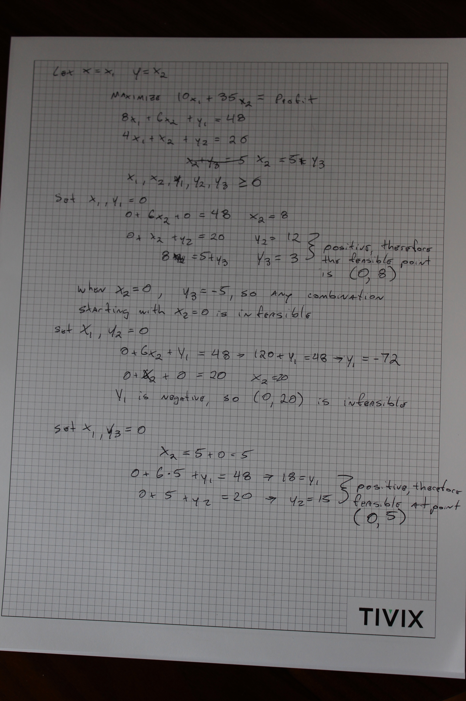

```{r setup, include=FALSE}
knitr::opts_chunk$set(echo = TRUE)
```

```{r}
library(ggplot2)
```


###1

Minimize: $cost(h, t, b, p) = 1.8h + 3.5t + 0.4b + 1.0p$

Subject to:

$0.5h + t + 2.0b + 6.0p \geq 40.0$

$2.0h + 4.0t + 0.5b + p \geq 20.0$

$5.0h + 2.0t + b + 2.5p \geq 25.0$

$h, t, b, p >=0$


###2

Using Desmos: 

Extreme points and their objective function value:   
x = 0, y = 8 -> **280**   
x = 0, y = 5 -> 175  
x = 2.25, y = 5 -> 197.50  

280 is the maximum value

###3

Page 1: 
Page 2: 

###4


###5


###6

```{r}
x <- c(7, 14, 21, 28, 35, 42)
y <- c(6, 41, 133, 250, 280, 297)
```

The function to minimize is: 

$$f(c) = \mid 6-7c \mid + \mid 41-14c \mid + \mid 133-21c \mid + \mid 250-28c \mid + \mid 280-31c \mid + \mid 297-42c \mid $$

on a closed interval $[0,42]$.

####a
$$ y = ax$$

```{r}
x <- c(7, 14, 21, 28, 35, 42) 


t = 0.2

iterations.estimate <- log(t / (42)) / log(0.618)
iter <- round(iterations.estimate, 0)
iter
```

```{r}
error.model <- function(c){
  
  f.c <- abs(6 - 7 * c) + abs(41 - 14  * c) + abs(133 - 21 * c) + abs(250 - 28 * c) + abs(280 - 31 * c) + abs(297 - 42 * c)
  return(f.c)
  
}
```

```{r}
r = 0.618

a = 42
b = 0

x1 <- a + (1 - r) * (b - a)
x2 <- a + r * (b - a)

error.model(x1)
error.model(x2)
```

```{r}
golden.endpoints <- function(endpoints){
  x1 <- endpoints[1] + (1 - r) * (endpoints[2] - endpoints[1])
  x2 <- endpoints[1] + r * (endpoints[2] - endpoints[1])  
  endpoints <- c(x1, x2)
  return(endpoints)
}
```

```{r}
test.endpoints <-function(endpoints, old.endpoints){
  f.x1 <- error.model(endpoints[1])
  f.x2 <- error.model(endpoints[2])
  
  if(f.x1 > f.x2){new.endpoints <- matrix(c(endpoints[1], old.endpoints[2]), nrow=1, byrow=T)} else {new.endpoints <- matrix(c(old.endpoints[1], endpoints[2]), nrow=1, byrow=T)}
  
  return(new.endpoints)
}
```

```{r}
list.endpoints <- matrix(c(0, 42), nrow = 1, byrow=T) 

for (i in 1:iter) {
  new.endpoints <- golden.endpoints(list.endpoints[i,])
  new.endpoints <- test.endpoints(new.endpoints, list.endpoints[i,])
  list.endpoints <- rbind(list.endpoints, new.endpoints)
}
list.endpoints
```

```{r}
slope <- mean(list.endpoints[iter+1,])
slope
```

This isn't exactly what is in the answer section of the book. I think the difference is due to float point math precision differences. 

```{r}
data <- as.data.frame(cbind(x, y))

ggplot(data, aes(x=x, y=y)) + geom_point() + geom_abline(slope = slope, intercept = 0)
```

####b
$$ y = ax^2$$

```{r}
x <- c(7, 14, 21, 28, 35, 42) ** 2


t = 0.2

iterations.estimate <- log(t / (1764)) / log(0.618)
iter <- round(iterations.estimate, 0)
iter
```

```{r}
error.model <- function(c){
  
  f.c <- abs(6 - 49 * c) + abs(41 - 196  * c) + abs(133 - 441 * c) + abs(250 - 784 * c) + abs(280 - 1225 * c) + abs(297 - 1764 * c)
  return(f.c)
  
}
```

```{r}
list.endpoints <- matrix(c(0, 1764), nrow = 1, byrow=T) 

for (i in 1:iter) {
  new.endpoints <- golden.endpoints(list.endpoints[i,])
  new.endpoints <- test.endpoints(new.endpoints, list.endpoints[i,])
  list.endpoints <- rbind(list.endpoints, new.endpoints)
}
list.endpoints
```

```{r}
slope <- mean(list.endpoints[iter+1,])
slope
```

```{r}
data <- as.data.frame(cbind(x, y))

ggplot(data, aes(x=x, y=y)) + geom_point() + geom_abline(slope = slope, intercept = 0)
```

####c
$$ y = ax^3$$

```{r}
x <- c(7, 14, 21, 28, 35, 42) ** 3


t = 0.2

iterations.estimate <- log(t / (74088)) / log(0.618)
iter <- round(iterations.estimate, 0)
iter
```

```{r}
error.model <- function(c){
  
  f.c <- abs(6 - 343 * c) + abs(41 - 2744  * c) + abs(133 - 9261 * c) + abs(250 - 21952 * c) + abs(280 - 42875 * c) + abs(297 - 74088 * c)
  return(f.c)
  
}
```

```{r}
list.endpoints <- matrix(c(0, 74088), nrow = 1, byrow=T) 

for (i in 1:iter) {
  new.endpoints <- golden.endpoints(list.endpoints[i,])
  new.endpoints <- test.endpoints(new.endpoints, list.endpoints[i,])
  list.endpoints <- rbind(list.endpoints, new.endpoints)
}
list.endpoints
```

```{r}
slope <- mean(list.endpoints[iter+1,])
slope
```

```{r}
data <- as.data.frame(cbind(x, y))

ggplot(data, aes(x=x, y=y)) + geom_point() + geom_abline(slope = slope, intercept = 0)
```

I'm not sure if this is a bug in my code or a really bad model. 