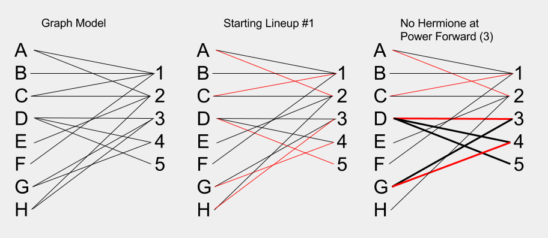

###1

a. deg(G) = 9, which is odd. G is not Eulerian - you cannot traverse each edge exactly once and arrive at the vertex you originated from. In order to traverse each edge from a vertex and arrive back at it, you must go 'out and back' which implies 2 edges. Therefore, over the whole graph in order to go 'out and back' in any order there must be an even number of edges. 

b. Yes, via the following route (one of several):
5-3
3-1
1-2
2-3
3-4
4-5
5-6
6-4
4-2

The necissary condition to have a walk that traverses all edges once but doesn't necissarily wind up in the same location is:
- have no more than one vertex with only one edge
- have no adjacent vertices with odd numbers of connections - evens can be adjacent to evens or odds, odds must be adjacent to evens. 

...there may be more, but these are what I found. 

###2

a. E(G) = {ab, ae, af, bd, bc, cd, df, de, ef}
b. {ab, bd, bc}
c. {b, d}
d. deg(a) = 3
e. |E(G)| = 9

I noticed that once you solved (a), you no longer need to refer to the drawn graph. All information is encapulated in the set describing the edges! It even becomes apparent how you could solve them algorithmically by iterating over the set E(G). 

###3



The team has a shallow bench at power forward (3), small forward (4), and center (5). So, if Hermione doesn't cover power forward, Deb and Gladys are the only ones left to cover the three 'big' positions of 3, 4, and 5, hence they cannot field a complete team. 

###4

First, create a matrix representation of the graph.
```{r}
a <- c(0, 2, 4, 0, 0, 0, 0, 0, 0, 0)
b <- c(2, 0, 0, 2, 7, 0, 0, 0, 0, 0)
c <- c(4, 0, 0, 0, 4, 2, 0, 0, 0, 0)
d <- c(0, 2, 0, 0, 0, 0, 2, 0, 0, 0)
e <- c(0, 7, 4, 0, 0, 0, 1, 2, 3, 0)
f <- c(0, 0, 2, 0, 0, 0, 0, 0, 6, 0)
g <- c(0, 0, 0, 2, 1, 0, 0, 0, 0, 8)
h <- c(0, 0, 0, 0, 2, 0, 0, 0, 0, 8)
i <- c(0, 0, 0, 0, 3, 6, 0, 0, 0, 2)
j <- c(0, 0, 0, 0, 0, 0, 8, 4, 2, 0)

graph <- as.matrix(cbind(a, b, c, d, e, f, g, h, i, j))
row.names(graph) <- c("a", "b", "c", "d", "e", "f", "g", "h", "i", "j")
graph
```

Using a package...

```{r}
library(igraph)
```

```{r}
adjacency <- graph.adjacency(graph, weighted=TRUE)
plot(adjacency)
```

```{r}
shortest.paths(adjacency, algorithm = "dijkstra")
```

The above shows the shortest path from a (0) to j (10) has a cost of 12. 

This shortest path is:
```{r}
get.shortest.paths(adjacency, from = 1, to = 10)$vpath
```


```{r}

get.paths <- function(node.array){
  paths <- which( node.array>0, arr.ind=TRUE)
  return(paths)}

get.costs <- function(node.array){
  costs <- node.array[node.array > 0]
  return(costs)}
```

```{r}
path.matrix <- cbind(get.paths(graph), get.costs(graph))
colnames(path.matrix) <- c("row", "col", "cost")
path.matrix
```

Now, I can traverse from col to row, with the cost associated with each path. 


###5

```{r}
s <- c(0,1,1,1,1,0,0,0,0,0,0,0)
x1 <-c(1,0,0,0,0,1,1,0,1,1,0,0)
x2 <-c(1,0,0,0,0,0,0,1,0,0,1,0)
x3 <-c(1,0,0,0,0,1,0,1,0,0,0,0)
x4 <-c(1,0,0,0,0,1,0,1,0,0,0,0)
y1 <-c(0,1,0,1,1,0,0,0,0,0,0,1)
y2 <-c(0,1,0,0,0,0,0,0,0,0,0,1)
y3 <-c(0,0,1,1,1,0,0,0,0,0,0,1)
y4 <-c(0,1,0,0,0,0,0,0,0,0,0,1)
y5 <-c(0,1,0,0,0,0,0,0,0,0,0,1)
y6 <-c(0,0,1,0,0,0,0,0,0,0,0,1)
t <- c(0,0,0,0,0,1,1,1,1,1,1,0)

max.graph <- as.matrix(cbind(s, x1,x2,x3,x4,y1,y2,y3,y4,y5,y6,t))
max.graph
```

```{r}
max.adjacency <- graph.adjacency(max.graph, weighted=TRUE)
plot(max.adjacency)
```
Maximum flow
```{r}
graph.maxflow(max.adjacency, source = 1, target = 12)$value
```


###6

$$Maximize z = \sum_{j} x_{sj} $$
$$subject\to:$$
$$\sum_{i} x_{ij} = \sum_{k}x_{jk} \ \forall j \in V(G) - {s, t} $$
$$ x_{ij} \leq u_{ij} \ \forall ij \in A(G) $$
$$ x_{ij} \geq 0  \ \forall ij \in A(G) $$

$$x_{ab} \leq 2 $$
$$x_{ac} \leq 6 $$
$$x_{bc} \leq 2 $$
$$x_{bd} \leq 4 $$
$$x_{cd} \leq 1 $$
$$x_{sa} \leq 4 $$
$$x_{sb} \leq 5 $$
$$x_{tc} \leq 7 $$
$$x_{td} \leq 3 $$
