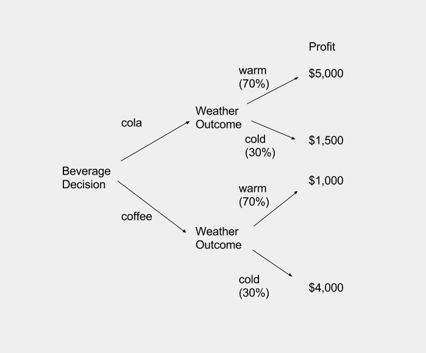
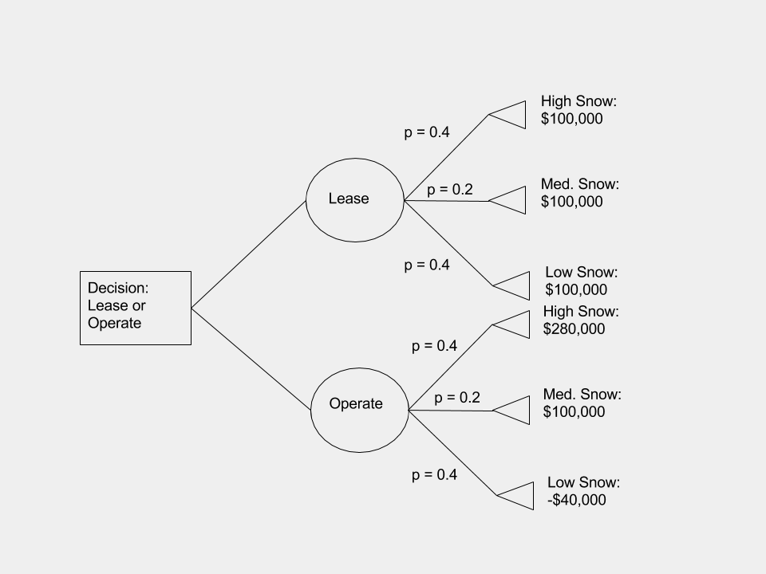

###1

```{r}
(2/5)*55000 + (3/5)*(-1750)
```

The expected value of the venture is $20,950. Definitely do it!

###2

Expected Value - selling cola
```{r}
(3/10)*1500 + (7/10)*5000
```

Expected Value - selling coffee

```{r}
(3/10)*4000 + (7/10)*1000
```

The expected value of selling cola is much higher ($3,950) than coffee ($1,900). The main driver here is the relatively low probability of the cold front. 



###3



```{r}
EV.lease = 1000
```

```{r}
EV.operate = 0.4*240000 + 0.2*100000 + 0.4*(-40000)
EV.operate
```

Lease and operate both have the same expected value. Therefore, other criteria must be used to make the decision. 

###4

Expected value with no geologist assessment:
```{r}
0.45 * (6000000 - 1000000) + 0.55 * (-1000000)
```

Expected value with a geologist assessment:
```{r}
assessment.positive <- 0.85 * 5000000 + 0.15 * (-1000000)

assessment.negative <- 0.22 * 5000000 + 0.78 * (-1000000)

0.6 * assessment.positive + 0.4 * assessment.negative
```

The company should hire the geologist to do the assessment. 

###5

Maximize expected value:
```{r}
(A <- 0.35 * 1100 + 0.3 * 900 + 0.25 * 400 + 0.1 * 300)
(B <- 0.35 * 850 + 0.3 * 1500 + 0.25 * 1000 + 0.1 * 500)
(C <- 0.35 * 700 + 0.3 * 1200 + 0.25 * 500 + 0.1 * 900)
```

Choose B.

Regret matrix:
```{r}
r.1 <- c(0, 1100 - 580, 1100 - 700)
r.2 <- c(1500 - 900, 0, 1500 - 1200)
r.3 <- c(1000 - 400, 0, 1000 - 500)
r.4 <- c(900 - 300, 900 - 500, 0)

regret.matrix <- cbind(r.1, r.2, r.3, r.4)

row.names(regret.matrix) <- c("A", "B", "C")

regret.matrix
```


Choose B. 