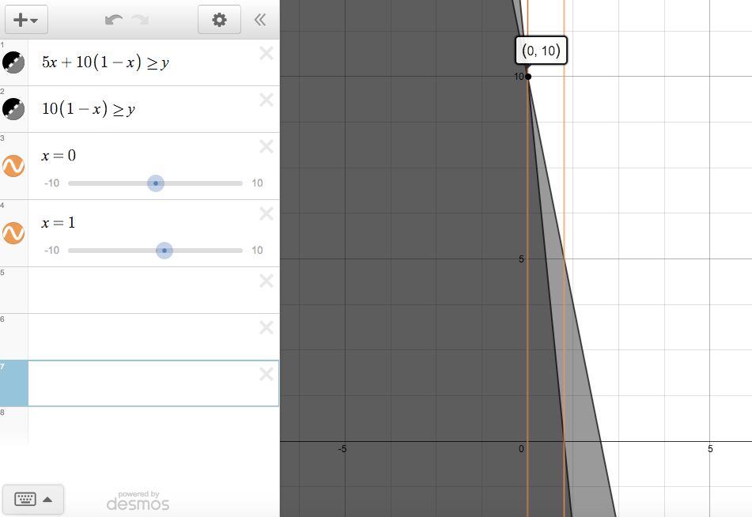
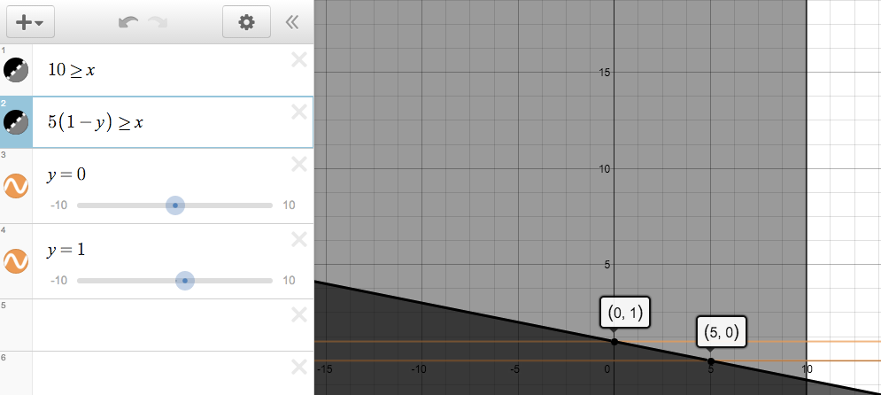
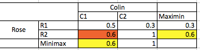
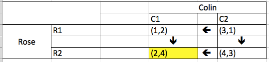
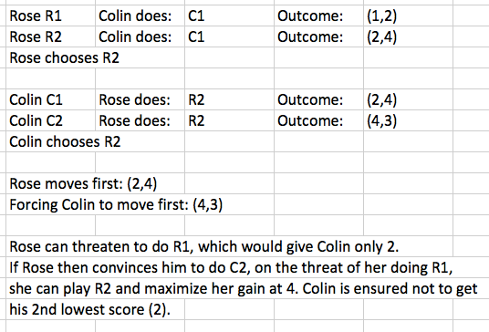
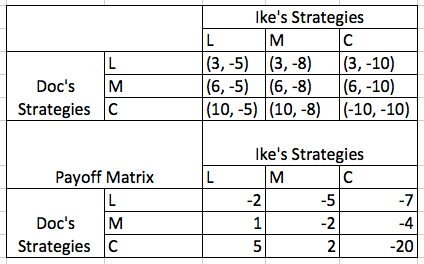

###1

Rose chooses R1 every time. 
Colin chooses C2 or C2. 

The game equilibrium equals 10. However, it is not a pure strategy Nash Equilibrium since Colin can choose either C2 or C3 and get the same result. 

###2

Pitcher chooses knuckleball every time, it is a dominant strategy. 
The Batter must subsequently guess knuckleball each time.

The pure strategy Nash equilibrium equals 0.250. 

###3
Linear Program for Rose


Linear Program for Colin



###4

```{r}
library(lpSolve)
```


```{r}
payoff.matrix <- as.matrix(rbind(
  c(3000, 4500, 6000),
  c(1000, 9000, 2000),
  c(4500, 4000, 3500)))
```


###5

Maximin = 20, Minimax = 15, therefore no pure strategy staddle point exists. 

Colin plays C1 or C2
Rose plays R1
Game value: 10

###6

a. equating expected value

First, check for pure strategy saddle point:  
  
One exists at C1, R2 and equals 0.6. 


b. methods of oddments

This method cannot be used due to the saddle point. 

###7


If both players maximize strategy, the likely outcome is (2,4).  



###8



The most likely outcome is for both players to try from long range on their first shot, with an expected value of -2 for Doc Holiday since he's the worse long-range shot. 

